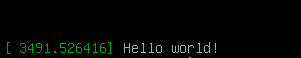
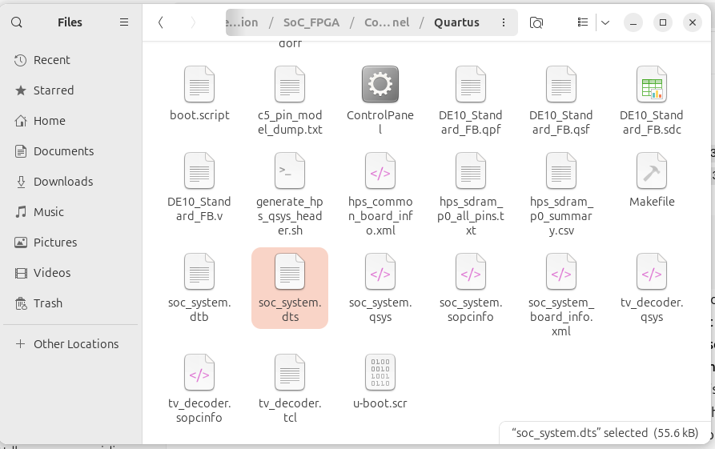
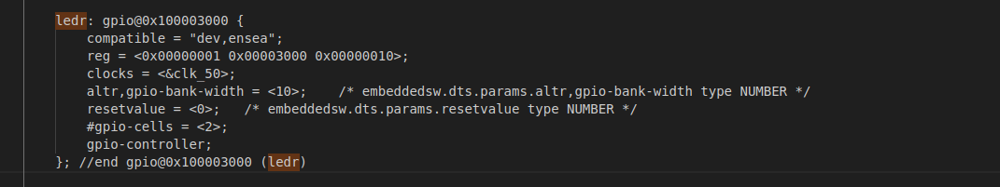

# TP_SOC_Linux_ENSEA_

## 1.1 Préparation de la carte SD


---

## 1.2 Démarrage
Après insertion de la carte SD et mise sous tension de la carte SoC, le système Linux embarqué démarre correctement.

---

## 1.3. Connexion au SoC via liaison série

Après avoir branché la carte VEEK-MT2S au PC à l’aide du port mini-USB (UART-to-USB), il est possible de détecter le port série correspondant grâce à :
```bash
dmesg | grep tty 
```

Puis, sous Linux, on utilise minicom :
```bash
sudo minicom -s
```


Après reboot du SoC, on observe toute la séquence de démarrage Linux jusqu’à l’apparition du login :


## 1.4. Configuration réseau du SoC

L’objectif est d’assigner une adresse IP statique au SoC pour permettre une connexion SSH depuis le PC.
Fichier `/etc/network/interfaces` modifié avec vim :

Le réseau est reconfigué 


Pour verfier le bon focntionnement, on va pinger la carte avec le PC :


## 2.Hello world 

- Dans cette partie, nous avons commencé par écrire un programme pour afficher "Hello World".
- Le fichier `hello.c` a été créé sur la machine hôte, puis transféré dans la VM.
- On a compilé avec `arm-linux-gnueabihf-gcc`.
- Une fois exécuté sur la carte, le programme a affiché correctement le message Hello World.
- Ce test valide la compilation ainsi que la communication entre la VM et le SoC.
  

## 3.chenillard
on peut écrire un programme C qui va ouvrir et écrire dans ces fichiers


## 4.Device tree 
Avant de commencer on va aller chercher le ficher dts



Modification de compatible = "dev,ensea"  dans  le fichier soc_system.dts




Pour compiler le device tree modifié, nous avons utilisé la commande: 

dtc -O dtb -o soc_system.dtb soc_system.dts.new


qui génère le fichier binaire soc_system.dtb destiné à être chargé par le noyau.

###  Accès à la VEEK et installation du nouveau Device Tree

Nous avons monté la partition de boot de la VEEK afin de remplacer le fichier DTB utilisé au démarrage :

mkdir /root/mntboot
mount /dev/mmcblk0p1 /root/mntboot

Nous avons ensuite renommé l’ancien device tree et copié le nouveau fichier compilé :

mv soc_system.dtb soc_system.dtb.old
cp soc_system.dtb /root/mntboot/

La carte a été redémarrée pour prendre en compte le nouveau device tree :

reboot

